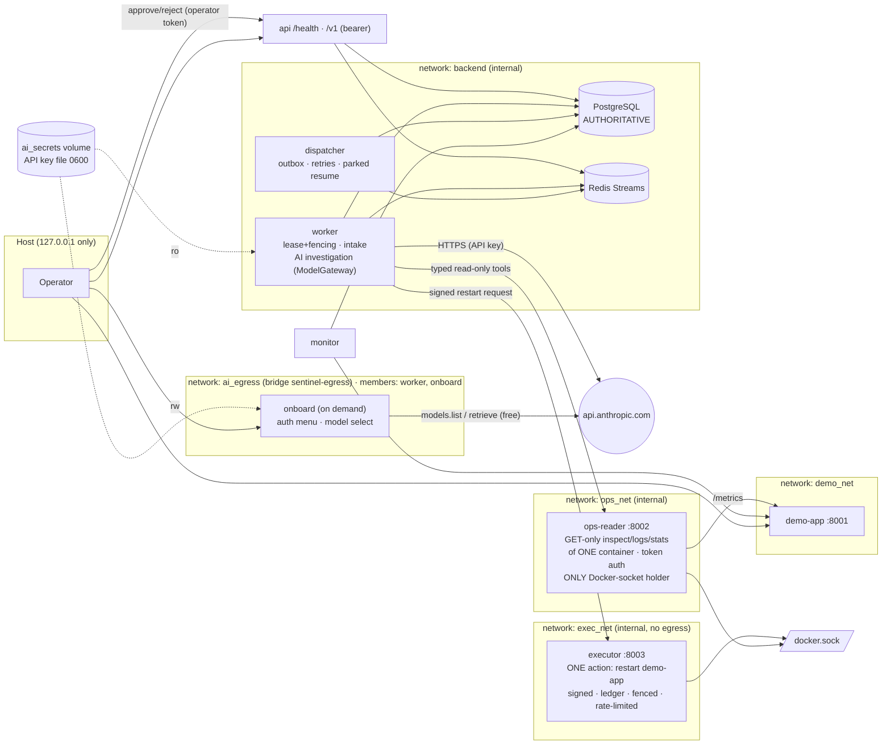
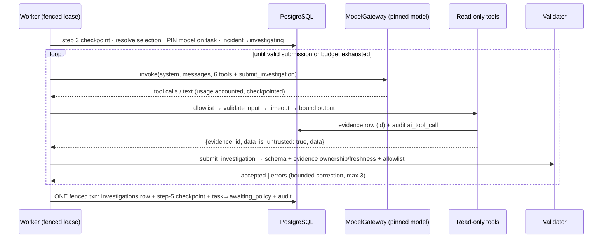
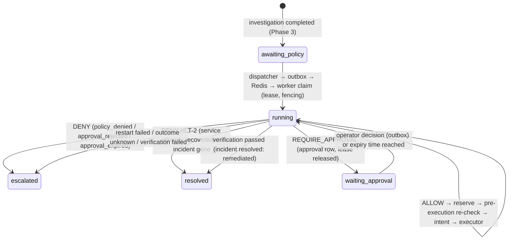
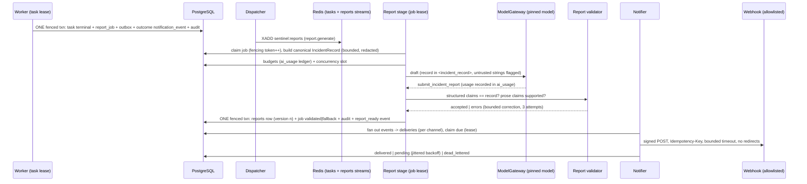

# SentinelOps architecture (through Phase 6)

## Runtime topology



- **Only two services hold the Docker socket**: `ops-reader` (read-only) and `executor`, which can perform exactly one action: restart the demo-app container. Neither is reachable by the model, and the AI worker has no socket. Docker socket group access is **root-equivalent on the host**. The narrow HTTP APIs, hardening and network isolation reduce that risk; they do **not** eliminate it.
- **Only `monitor` probes the demo app.** The **worker cannot reach the demo app or Docker**; all diagnostics go through `ops-reader`. `ops-reader` is the *only* service with the Docker socket. It calls only GET inspect/logs/stats for the one container labelled `sentinelops`/`demo-app`, never returns env or config, has a token-protected API, no published port, and is not on `ai_egress`. It sits on `demo_net` to read `/metrics`.
- **`ai_egress` is the only internet route**, used by the worker and the one-off `onboard` tool to reach the Anthropic API. The demo app and datastores have no path to it.
- The API key lives only in the `ai_secrets` volume (read-only in the worker). It is never stored in env, `.env`, the DB or logs. See [auth-decision.md](auth-decision.md).
- All Python containers run as UID 10001 with a read-only root FS, `cap_drop: ALL`, `no-new-privileges` and limits. App DB connections are time-bounded.

## Workflow steps 1–3 (Phase 2, fully deterministic)

```mermaid
sequenceDiagram
    participant P as Monitor probe loop
    participant R as Monitor recorder thread
    participant DB as PostgreSQL
    participant D as Dispatcher
    participant S as Redis Stream
    participant W as Worker
    P->>P: GET /health (monotonic latency, UTC timestamp)
    P->>R: bounded buffer (never blocks on DB)
    R->>DB: ONE txn: health_check + detection_state [+ incident + task + evidence + outbox + audit]
    D->>DB: SELECT unpublished outbox FOR UPDATE SKIP LOCKED
    D->>S: XADD
    D->>DB: mark published (same txn; crash ⇒ re-publish ⇒ duplicate OK)
    W->>S: XREADGROUP / XAUTOCLAIM idle > pending_idle
    W->>DB: claim lease (fencing_token++); fenced checkpoint + transition
    W->>S: XACK only after commit
```

### Detection rules (`app/monitoring/detector.py`, pure and unit-tested)
| Rule | Value (configurable) |
|---|---|
| Probe cadence / timeout | 30 s / 5 s (`timeout < interval` enforced, so probes cannot overlap). The timeout is a **hard deadline for the whole probe, DNS included** (Phase 6 fix D1: Docker DNS stalled about 10 s for a stopped container, which httpx timeouts do not bound) |
| `unavailable` | 3 consecutive timeouts or connection errors |
| `http_error` | 3 consecutive non-2xx |
| `high_latency` | 3 consecutive 2xx responses slower than 2 s (outcome `degraded`) |
| Counting | per failure type, **consecutive**; any other result breaks that type's streak |
| Dedup | at threshold the type **disarms**; further failures only bump `occurrence_count`/`last_seen_at`. The DB partial unique index is the final guard (`INSERT … ON CONFLICT … DO UPDATE`) |
| Hysteresis / re-arm | 3 consecutive **healthy** checks (degraded does not count) re-arm the type |
| Auto-resolve | on recovery, an incident in `open` or `investigating` with no task currently running is resolved `auto_recovered` and its non-running task closed (AI findings are kept). **Remediating, awaiting-approval and escalated incidents stay open** for their owner or a human |
| Evidence | the threshold window's check rows, rule, and first/last failure time, stored as a SHA-256-addressed `evidence` row |

### Startup, restart and outage behaviour
- **Leadership:** a session-level advisory lock ensures one active monitor. A standby does not probe and takes over when the lock is freed. Release unlocks and closes the physical connection (a pooled session would keep the lock).
- **Restart:** detection state lives in `detection_state`, so streaks continue. If the gap since the last check exceeds 3 intervals, streaks reset but armed/disarmed is kept, so an ongoing incident is not re-opened as a duplicate.
- **DB outage:** the probe loop keeps running. Results buffer in order (bounded at 2880, about 24 h; the oldest are dropped and counted) and are recorded with original timestamps when the DB returns, so detection still sees failures that happened during the outage.
- **Redis outage:** incidents, tasks and outbox rows are still committed. Publication retries with backoff (`publish_attempts`, `last_error`, `next_attempt_at`) and delivers when Redis returns.

### Delivery guarantees (at-least-once, idempotent)
| Failure window | Handling | Test |
|---|---|---|
| Crash after DB commit, before publish | row stays unpublished and is published next cycle | `test_crash_after_commit_before_publish_is_eventually_published` |
| Crash after XADD, before marking published | txn rolls back, then re-publish creates a duplicate message; the claim fails for the duplicate, so exactly one intake | `test_crash_after_publish_before_mark_cannot_duplicate_work` |
| Worker crash after commit, before XACK | XAUTOCLAIM, then the task is terminal/parked so the message is ACKed as a duplicate | `test_worker_crash_after_commit_before_ack_is_recovered` |
| Worker crash mid-task | lease expires, then XAUTOCLAIM re-delivers and the claim succeeds (token+1) | `test_expired_lease_message_reclaimed_via_pending_recovery` |
| Message lost in Redis | reconciler re-dispatches tasks with no progress after `redispatch_after` (dedup-keyed per window) | `test_lost_stream_message_is_reconciled` |
| Two executors | claim requires expired lease; every write is fenced on `(owner, fencing_token)`; a DB trigger rejects stale checkpoints | `test_two_workers_racing_only_current_fencing_holder_advances` |
| Repeated failure | backoff `min(300, 10·2^(n-1))` s, max 3 attempts, then `dead_lettered`, dead-letter stream entry, incident `escalated` | `test_exhausted_retries_dead_letter_and_escalate` |

Task states: `queued → running → awaiting_policy` (investigation done; rests until Phase 4) · `awaiting_investigation` (parked: AI not configured, or paused by an auth/quota/rate-limit problem) · `retry_scheduled` · `failed` · `dead_lettered` · `resolved` · `escalated` · `waiting_approval` (Phase 4).

## Workflow steps 4–5 (Phase 3, AI investigation, proposal only)



**Tools** (`app/agent/tools.py`). All are typed, reject extra fields, run under a hard timeout, have bounded output, and write an evidence row plus an audit row. An unavailable source is reported as `unavailable`; nothing is ever fabricated.

| Tool | Real data source | Bounds |
|---|---|---|
| `get_incident` | incident row + existing evidence ids | 20 evidence refs |
| `get_health_history` | `health_checks` of the incident's service | `limit` ≤ 50 |
| `get_application_logs` | ops-reader → Docker logs (redacted twice, untrusted) | `tail` 10–200, 500 chars/line, level filter |
| `get_container_status` | ops-reader → Docker inspect (state, restarts, OOM, health; no env) | fixed fields |
| `get_resource_metrics` | ops-reader → Docker stats + app `/metrics` (injection fields withheld) | fixed fields |
| `get_previous_incidents` | earlier incidents of the same service + their proposed action | `limit` ≤ 10 |

No shell, filesystem, URL fetch, Docker socket, network scan, write or remediation tool exists. An unknown tool name is rejected and audited (`ai_tool_rejected`), never executed.

**Result schema** (`app/agent/schema.py`, `extra="forbid"`):
- `incident_id`
- `observations[{statement, evidence_ids≥1}]`
- `evidence_ids`
- `hypotheses[{statement, certainty="hypothesis", confidence, supporting_evidence_ids}]`
- `missing_evidence`
- `proposed_action{action ∈ restart_demo_app|no_action|escalate_to_human, target_service, rationale, evidence_ids}`
- `risks`
- `verification_plan`
- `next_step`

Fields for a policy verdict, execution status or resolution status do not exist, so supplying one fails validation.

**Validator** (`app/agent/validator.py`) checks that:
- the result matches the schema;
- `incident_id` equals the task's incident;
- every cited id is listed, exists, belongs to *this* incident and is fresh (≤ 1 h);
- a restart proposal targets `demo-app` with evidence;
- no statement claims an action was performed.

Rejections are returned to the model, up to 3 attempts. The investigation is then persisted as `failed` and the task and incident are escalated.

**Budgets** (enforced by the orchestrator and carried across crash/pause via the step-4 checkpoint):
- 6 diagnostic calls
- 3 reasoning attempts
- tool calls + attempts + 2 model calls
- 600 s wall clock
- 300k tokens
- optional USD cap (operator prices)

Exhaustion persists `insufficient_evidence` and escalates.

**Prompt-injection containment**: the system prompt is fixed and states that tool data is untrusted. Tool output reaches the model only inside `tool_result` envelopes marked `data_is_untrusted`, after redaction. The tool set and system prompt never change during a run. Whatever the model is persuaded to output must still pass the allowlist, the evidence checks and the schema, and the model can only *propose*.

**Recovery**:
| Situation | Behaviour |
|---|---|
| Worker crash mid-investigation | lease expiry → XAUTOCLAIM/reconciler → resumes from the step-4 checkpoint (evidence ids, counters, pinned model) |
| Duplicate message after completion | `awaiting_policy` is not claimable → ACK only |
| Stale executor | fenced writes → `LeaseLost`, nothing persisted |
| Auth, quota or rate limit | task parked with backoff, attempt refunded; dispatcher `schedule_parked_investigations` re-dispatches through the normal outbox when due |
| AI not configured (e.g. Phase 2 tasks) | parked indefinitely; resumes once a model is selected |
| Provider 5xx/timeout | bounded task retries → dead letter → escalated |

**Auto-resolve** now also covers `investigating` incidents whose task isn't running. Findings stay persisted.

### Status API and metrics
`GET /v1/incidents[?status=&limit≤100]`, `/v1/incidents/{id}` (with tasks and evidence), `/v1/tasks/{id}` (with checkpoints) and `/v1/metrics` (Prometheus text). All need `Authorization: Bearer $SENTINEL_API_READ_TOKEN` (≥32 chars, constant-time compare). If no token is configured the API **fails closed** with 503. There are no write methods.

Metrics are derived from PostgreSQL and Redis, so they are shared across processes and survive restarts:
- `sentinel_health_checks_retained{outcome}`
- `sentinel_last_check_age_seconds`, which tracks monitor liveness
- `sentinel_incidents_detected_total{incident_type}`
- `sentinel_incidents_active{status}`
- `sentinel_tasks{status}`
- `sentinel_task_retries_total`
- `sentinel_tasks_dead_lettered_total`
- `sentinel_outbox_unpublished`
- `sentinel_outbox_oldest_unpublished_age_seconds`, the DB→queue lag
- `sentinel_queue_stream_length`, `sentinel_queue_pending` and `sentinel_queue_lag`, the stream lag
- `sentinel_redis_up`

## Schema overview

Conventions: `uuid` primary keys (`gen_random_uuid()`), every timestamp is `timestamptz` (server `timezone=UTC`), status columns constrained by `CHECK`, and `updated_at` maintained by trigger. Migrations are versioned in `alembic_version` and serialize with an advisory lock. Revisions: `0001_initial_schema` → `0002_monitoring_queue` → `0003_ai_investigation` → `0004_policy_execution` → `0005_reliability_reporting`.

| Table | Purpose | Key constraints / indexes |
|---|---|---|
| `services` | Monitored targets | `name` unique, `environment = 'demo'` only (no production targets) |
| `health_checks` | Every probe result (7-day retention) | `outcome ∈ {healthy, degraded, unhealthy, timeout, error}`, `(service_id, checked_at DESC)`, `(checked_at)` |
| `detection_state` | Per service + failure type state machine | unique `(service_id, failure_type)`, armed, streaks, window check ids |
| `incidents` | Deduplicated incidents | status CHECK, `resolved_at` set iff resolved/closed, first/last failure, `resolution`, **partial unique `(service_id, incident_type)` WHERE active** |
| `tasks` | Durable agent tasks | status CHECK (above); unique `idempotency_key`; lease owner+expiry paired; `fencing_token`; `outcome`; one active task per incident |
| `outbox_events` | Transactional outbox | unique `dedup_key`, `next_attempt_at` backoff, `stream_message_id`, due index |
| `task_checkpoints` | Per-step checkpoints (steps 1–10) | unique `(task_id, step)`; **fencing trigger** accepts only the current unexpired lease holder |
| `action_attempts` | Remediation attempts (Phase 4) | unique `action_id`, `action_type ∈ {restart_demo_app}` |
| `approvals` | Human approvals (Phase 4) | expiry after request; decided fields iff approved/rejected; one pending per task |
| `evidence` | Evidence records | `source` CHECK, SHA-256, unique `(incident_id, source, content_sha256)` |
| `reports` | Versioned incident reports (Phase 5) | **append-only** (UPDATE/DELETE/TRUNCATE refused); unique `(incident_id, version)`, unique `job_id`; `generation_mode ∈ {ai, deterministic_fallback}`; model/auth only for `ai`; `record_sha256` provenance |
| `audit_events` | Audit trail | `actor_type ∈ {system, ai, human}`; **append-only trigger** |
| `model_config` | Selected auth *mode* + model ID | **no credential columns**; one active row; `auth_mode ∈ {api_key, subscription, mock}` (`subscription` is never written; `mock` is test/demo only) |
| `investigations` | One AI investigation per task (latest outcome) | `status ∈ {completed, insufficient_evidence, failed}`, `result` set iff completed, `failure_reason` otherwise, pinned `model_id` + `auth_mode`, usage/cost counters, rejections, `fencing_token` |


## Workflow steps 6–8 (Phase 4: policy, approval, execution, verification)



### Policy (`app/safety/policy.py`)
The policy is a pure, deterministic function with no LLM and no I/O. Its inputs are the investigation's allowlisted `proposed_action` and cited evidence IDs, authoritative DB state and trusted config. The model's prose (rationale, hypotheses, confidence) is **not** an input. It returns `ALLOW | REQUIRE_APPROVAL | DENY` with rule IDs. **Any missing input or evaluation error denies (`SYS-1`).** Each decision is stored append-only in `policy_decisions` with its reasons, inputs, policy version and action fingerprint. The worker evaluates twice per execution: `proposal`, then `pre_execution` **immediately before the side effect**.

| Rule | Denies when |
|---|---|
| INV-1 | no completed, validated investigation for this task/incident |
| ACT-1 | action not in `restart_demo_app, no_action, escalate_to_human` |
| ENV-1 / ENV-2 | environment is production / `remediation_environment` ≠ `isolated-demo` |
| TGT-1 / TGT-2 | proposed target ≠ trusted `remediation_target_service` / incident's service isn't the trusted demo target (`environment='demo'`) |
| INC-1 | incident not in `open, investigating, remediating, waiting_approval` |
| EVD-1 / EVD-2 | cited evidence missing, from another incident, or stale |
| HLT-1 / HLT-2 | no fresh health check (≤ 120 s) confirms the failure / the service is healthy again |
| LIM-1 / LIM-2 | restart limit per incident (1, also a DB unique index) / per hour |
| DUP-1 | this action already executing or finished |
| LSE-1 | (pre-execution) the worker no longer holds the current lease |
| EXE-1 | executor not configured |
| CST-1 | investigation exceeded its cost cap |

`escalate_to_human` → ALLOW `ESC-1`: escalation only, no side effect. `no_action` → ALLOW `NOA-1`: the task resolves if the service is healthy, otherwise it escalates. Recovery is never claimed.

**Authorization of a restart** (only after every rule above passes):
- `AUT-1`: autonomy enabled (`SENTINEL_REMEDIATION_AUTO_ENABLED=true` **and** `SENTINEL_REMEDIATION_ENVIRONMENT=isolated-demo`; forbidden in production by settings validation). The default is **off**.
- otherwise, if approvals are enabled, a human approval:
  - `APR-0`: request an approval
  - `APR-2`: still waiting
  - `APR-1`: approved, with a valid signature from an active approver, before expiry, with a matching fingerprint
  - `APR-3`: expired
  - `APR-4`: fingerprint changed
  - `APR-5`: forged or tampered signature
  - `APR-6`: decider isn't an active approver
  - `APR-7`: rejected
- `AUT-2`: autonomy and approvals both disabled → DENY.

The **action fingerprint** is SHA-256 over the incident, task, investigation, action, trusted target, deterministic action ID and **policy version** (a hash of the remediation config). An approval can never authorize a different action, target, investigation or policy.

### Human approval (`app/safety/approvals.py`, `app/api/approvals.py`)
- **Operators:** `docker compose run --rm onboard operator-add NAME approver|viewer` creates an operator. The token is shown once; only its SHA-256 is stored. Disable an operator with `operator-disable`.
- **API:**
  - `GET /v1/approvals` and `GET /v1/approvals/{id}` need any operator.
  - `POST /v1/approvals/{id}/approve|reject` with `{"action_fingerprint": …}` needs the `approver` role.
- **CSRF:** only the `Authorization` header authorizes; there are no cookies. POSTs must be `application/json`, and `Sec-Fetch-Site: cross-site` or a foreign `Origin` is refused. The unauthenticated dashboard has **no** approval UI.
- **Replay and concurrency:** a decision is one conditional `UPDATE … WHERE status='pending' AND expires_at > now() AND action_fingerprint = :fp`. Replays and concurrent decisions get 409, and exactly one decision wins (tested with 6 concurrent approvers).
- **Forgery:** each decision is HMAC-signed by the API (`SENTINEL_APPROVAL_SIGNING_KEY`) and verified by the worker. A row edited directly in PostgreSQL authorizes nothing (`APR-5`).
- **Waiting:** the task is parked in `waiting_approval` **without holding a worker** and re-dispatched at expiry, so silence fails closed as `approval_expired`, or immediately after a decision. Notification is a WARNING log line plus the incident appearing in `/v1/approvals`. A notification failure cannot approve anything.

### Restricted executor (`app/executor/`)
A separate service on the internal `exec_net` (no egress, no demo network). It performs **one** operation: `POST /containers/{id}/restart` on the single container labelled `sentinelops`/`demo-app`. The request cannot name a target, and extra fields are rejected. Each request is checked for:
- a bearer token;
- an HMAC signature (`SENTINEL_ACTION_SIGNING_KEY`) over `(action, action_id, fencing_token, fingerprint, not_after)`, with an expiry of 60 s and a lifetime of at most 600 s;
- a durable **SQLite ledger** (`executor_state` volume). The `started` row is committed **before** the Docker call. Per action ID it gives at-most-once execution, replays of recorded results, refusal of a lower fencing token (`stale`) or changed fingerprint, and refusal to redo an in-progress or interrupted action;
- an hourly cap.

### Idempotency and crash recovery (`app/safety/remediation.py`)
The action ID is deterministic, `uuid5(incident)`, and `action_attempts` has a unique index on `(incident_id, action_type)`. A unique constraint alone is not enough for an external side effect, so recovery also reconciles against the executor's ledger and the container's `StartedAt`:

| Crash point | Durable state | Recovery | Tested |
|---|---|---|---|
| before reservation | nothing | re-evaluate from scratch | implicit in all |
| after reservation | attempt `pending` | policy re-checked → execute once | `test_crash_after_reservation_before_execution` |
| after intent, request never sent | `executing`, no ledger entry | back to `pending` (fenced) → policy re-check → execute once | `test_crash_before_request_reached_executor` |
| during execution (worker killed) | `executing`, ledger `started`/`completed` | reconcile from the ledger; **no second restart** | `test_worker_killed_during_execution_reconciles_without_duplicate` (live) |
| executor interrupted mid-action | ledger `started`, no restart observed | `unknown` → **escalate, never re-issue** | `test_executor_interrupted_mid_action_outcome_unknown_escalates` |
| executor interrupted, restart observed | ledger `started`, `StartedAt` changed | `reconciled` → verify | `test_executor_interrupted_but_restart_observed_is_reconciled` |
| after execution, before recording | ledger `completed` | recorded from the ledger → verify; no repeat | `test_crash_after_execution_before_recording_reconciles_no_repeat` |
| after recording, before verification | attempt `succeeded` | verify only | `test_crash_after_recording_before_verification` |
| after completion, before ACK | task terminal | duplicate message ACKed; no effect | `test_duplicate_stream_delivery_never_restarts_twice`, live duplicate test |
| stale worker | old lease | fenced DB writes fail; executor refuses the lower fencing token | `test_stale_worker_cannot_execute` |

### Recovery verification (`app/safety/verification.py`)
A deterministic check that the model has no say in. Probes are fresh, run through the read-only `ops-reader` `/v1/target/probe`, and poll on an interval bounded by a deadline (no fixed sleeps). **Pass** requires `verify_consecutive_successes` (3) consecutive successful probes, each faster than `verify_latency_max_seconds` (2 s), within `verify_readiness_deadline_seconds` (120 s). It also requires **no new** `ERROR`/`CRITICAL` log lines since the restarted process started (logs `since` its `StartedAt`). If log evidence is unavailable, verification fails closed. The results go into `verifications` (criteria and every observation) plus a `verification` evidence row.
- **Passed:** incident `resolved` (`remediated`), task `resolved:recovery_verified`.
- **Failed:** task `escalated:recovery_failed`, incident `escalated` and **still open**. No second restart (limit 1).
- **Recovered before the action** (`HLT-2`): no restart. The incident goes back to `investigating`, so the **monitor's** healthy-check hysteresis decides whether it resolves (`auto_recovered`).

### Security boundaries (Phase 4)
| Component | Can | Cannot |
|---|---|---|
| Model | choose read-only tools; propose an allowlisted action | reach Docker, shell, secrets, DB, policy, approvals, or the executor |
| Policy | decide deterministically from DB state and config | be edited by the model (config only; its version is bound into every fingerprint) |
| Executor | restart ONE labelled container for signed, current, unique requests | choose a target; run other Docker verbs; reach the internet or the demo network |
| Approval API | record an authenticated approver's decision, signed | approve without a token or role, after expiry, with a changed fingerprint, or twice |
| Verifier | pass or fail recovery from fresh probes and logs | use model opinion |


## Workflow steps 9–10 and cross-cutting factors (Phase 5)



### Canonical incident record (`app/reporting/record.py`)
The report's only input. It is built by explicit, bounded queries from PostgreSQL (never by
forwarding arbitrary rows) and contains:
- incident metadata and detection timestamps;
- triggering health-check evidence (≤ 10 checks) and a monitoring-window outcome summary;
- every evidence row (id, source, tool, status, SHA-256; ≤ 100);
- up to 3 redacted log excerpts, in a field literally named `untrusted_log_excerpts`;
- the investigation: model, auth mode, `is_mock`, budgets used, and the model's own statements
  under `ai_observations` / `ai_hypotheses`;
- the proposed action;
- policy decisions with rule IDs, approvals with deciders, and action attempts with an
  `executed` flag;
- verifications with probe counts;
- escalation reasons;
- AI usage and cost (estimates only when prices are configured);
- whitelisted audit events and a deterministic timeline.

`sha256` of the canonical JSON is stored with every report as provenance.

### Separation of facts and narrative
The published report's **facts sections are always rendered from the record**:
- detection evidence;
- investigation facts;
- evidence reviewed;
- hypotheses, labelled *UNCONFIRMED, not root causes*;
- the proposed action (what the AI recommended);
- policy decisions (deterministic engine);
- approval history;
- actions *actually executed* (executor records, with EXECUTED / NOT executed);
- recovery verification (deterministic verifier);
- the outcome (durable state);
- AI usage and cost.

Only the summary, timeline wording, observations, unresolved questions and follow-ups come from
the draft, and only after validation. A draft therefore cannot redefine what happened.

### Deterministic validator (`app/reporting/validator.py`)
- **Structured claims must equal the record in both directions.** Nothing may be invented or
  omitted. This covers: incident id, service, type, severity and detected-at (±2 s); every
  policy decision (phase, decision, rule IDs); every approval (status, deciding operator); every
  action attempt and its status; every verification and its status; the proposed action and its
  investigation; the outcome; and the investigation model and auth mode.
- **Cited evidence** must exist in this incident's record. Evidence that exists but belongs to
  another incident is reported as such.
- **Timeline timestamps** must match a timestamp of a cited record.
- **Prose claims** are checked per clause, with negation handled (so "was not restarted" is not
  a claim) and questions ignored:
  - execution claims need an executed attempt;
  - recovery claims need a passed verification or a monitor auto-recovery;
  - root-cause claims must be hedged, since the evidence contract never confirms a root cause;
  - approval, policy and verification claims need the matching record;
  - "approved by X" must name a real decider;
  - Claude/Anthropic/model-family claims need a real (non-mock) Claude call;
  - timestamps, costs and token counts are not allowed in prose.

Rejections go back to the model as tool errors: at most 3 attempts, then the deterministic
fallback. Each rejection is audited (`report_validation_rejected`).

### Fallback and generation modes
`deterministic_fallback` is used when:
- AI reporting is disabled;
- no model is selected;
- credentials are missing, authentication fails, or quota or rate limits are hit
  (`ai_unavailable_<kind>`);
- a daily or incident budget is spent;
- the time or token budget for the report is exhausted;
- validation keeps failing;
- or it is the job's **final attempt** (`final_attempt_deterministic`). The final attempt makes
  the fallback reachable even after repeated provider 5xx/timeouts, which are retried first with
  jittered backoff.

A fallback report has `model_id` and `auth_mode` NULL; a DB CHECK enforces this. A mock draft is
labelled *TEST/DEMO ONLY - not Claude*.

### Report job lifecycle and idempotency (`app/reporting/jobs.py`, `consumer.py`)
Job states run `pending → generating → validated | fallback`, with `pending` on retry and
`failed` once attempts are exhausted (plus a `report_failed` notification and an alert). The job
uses the same contract as tasks:
- a DB lease with a fencing token;
- a heartbeat;
- ACK only after commit;
- a lost lease is not ACKed;
- duplicates are ACKed;
- XAUTOCLAIM and the dispatcher's `schedule_report_jobs` handle a dead worker or a lost message.

The report row, the job's terminal status, the audit event and the `report_ready` event commit in
**one fenced transaction**. A stale worker's write rolls back entirely, and `reports.job_id` is
unique.

| Crash point | Outcome | Test |
|---|---|---|
| before the model call | lease expires, reclaimed, exactly 1 report | `test_crash_during_reporting_recovers_to_exactly_one_report[before_model_call]` |
| after the model call | usage already recorded; re-drafted; 1 report | `[after_model_call]` |
| before persistence | nothing persisted; re-drafted; 1 report | `[before_persist]` |
| after persistence, before ACK | redelivery is a duplicate: ACK, no second report | `test_crash_after_persistence_and_duplicate_delivery_ack_without_second_report` |
| duplicate Redis delivery | claim refuses: ACK | same, plus live `test_duplicate_report_and_notification_work_is_idempotent` |
| stale worker | fenced out; no partial write | `test_stale_report_worker_is_fenced_out` |
| worker killed mid-report (live) | 1 report, attempt ≥ 2 | `test_worker_killed_during_reporting_recovers_to_one_report` |

### Canonical lifecycle (`app/agent/lifecycle.py`)
The 13 contract states are:
`DETECTED, QUEUED, INVESTIGATING, ACTION_PROPOSED, POLICY_CHECK, WAITING_APPROVAL, EXECUTING,
VERIFYING, REPORTING, RESOLVED, RETRY_SCHEDULED, ESCALATED, FAILED`.

They are **derived** from durable records (never stored separately, so they cannot drift) and
exposed as `lifecycle_state` in `GET /v1/incidents/{id}`. Legal edges are an explicit table; it
does not allow execution before policy, or resolution without reporting. Terminal states are
final. The DB trigger `trg_tasks_guard_status` enforces the corresponding `tasks.status` edges
(terminal is final; `running` only from claimable states; parking only from `running`), with
SQLSTATE `SF002`.

### Notifications (`app/notifications/`)
- **Events.** A `notification_events` row is created in the same transaction as the change it
  describes, with deterministic whitelisted payloads and a dedup key. Event types:
  `approval_required`, `incident_escalated`, `remediation_performed`,
  `recovery_verification_failed`, `ai_paused`, `task_dead_lettered`, `system_degraded`,
  `alert_resolved`, `report_ready`, `report_failed`, `test`. Payloads never contain tokens, keys,
  fingerprints or raw logs.
- **Deliveries.** One `notification_deliveries` row per configured channel. Each delivery is
  leased, fenced on `(owner, attempt)`, retried with bounded, jittered exponential backoff, then
  dead-lettered and alerted.
- **Retry policy.** A 2xx is delivered. 408, 425, 429, 5xx and transport errors are retried.
  Redirects and other 4xx are dead-lettered immediately.
- **Channels.** `NotificationChannel` has `LogChannel` and a generic signed `WebhookChannel`.
  Every webhook request is signed (`X-SentinelOps-Signature: sha256=HMAC(secret,
  "<timestamp>.<body>")`) and carries `Idempotency-Key: <event id>`.
- **SSRF.** The destination comes only from configuration: one URL, an explicit host allowlist,
  HTTPS outside development/test/demo, no userinfo, link-local/metadata always refused, and
  private/loopback refused in production. The client has no redirects, no proxy from the
  environment, a bounded timeout and a bounded read. The model never supplies a URL.
- **Isolation.** The notifier service holds only DB credentials and the webhook secret; it has no
  Docker socket, AI key, executor token or signing keys. It sits on `backend` and the internal
  `notify_net`, and gets egress only via `docker-compose.notify-egress.yml`.
- **Test channel.** Dev/test only: `notify-sink`.

### Alerts and degraded modes
- **In-app deterministic rules** (`app/notifications/alerts.py`, evaluated by the notifier every
  30 s and edge-triggered through `alert_state`): `monitor_silent`, `queue_backlog`,
  `ai_auth_failed` (actionable: `onboard set-key`), `ai_paused`, `ai_budget_exhausted`,
  `stalled_incident`, `backup_failed`, `notifications_failing`, `report_failures`,
  `service_down`, `executor_unreachable`.
- **External rules** (`deploy/observability/alerts.yml`, checked with promtool and unit-tested
  with `alerts_test.yml`) cover the same conditions plus **host/API down**. That one needs an
  external vantage point.
- **`GET /v1/system/status`** reports per-component state and the modes:
  - `CORE_HEALTHY`;
  - `AI_DEGRADED`, `NOTIFICATIONS_DEGRADED`, `EXECUTOR_DEGRADED`, `MONITOR_DEGRADED`,
    `REPORTING_DEGRADED`, `BACKUPS_DEGRADED`;
  - `REDIS_UNAVAILABLE`, `DATABASE_UNAVAILABLE`.

  Liveness and readiness semantics are unchanged.

### Metrics (all derived from PostgreSQL and Redis; label values come from bounded sets)
Every label is checked against `BOUNDED_LABELS`, and no ID is ever used as a label value
(`test_metrics_exposed_with_bounded_labels`).

**Monitoring:**
- `sentinel_monitor_success_ratio`
- `sentinel_detection_latency_seconds`
- `sentinel_last_check_age_seconds`
- `sentinel_health_checks_retained{outcome}`

**Incidents:**
- `sentinel_incidents_detected_total`
- `sentinel_incidents_active{status}`
- `sentinel_incidents_resolved_total{resolution}`
- `sentinel_incidents_escalated_total`
- `sentinel_incident_oldest_active_age_seconds`

**AI:**
- `sentinel_ai_calls_total{stage,outcome}`
- `sentinel_ai_usage_tokens_total{stage,kind}`
- `sentinel_ai_cost_usd_estimate_total{stage}` (only when priced)
- `sentinel_ai_call_latency_seconds_sum/_count{stage}`
- `sentinel_ai_auth_errors_total`
- `sentinel_ai_daily_tokens`
- `sentinel_ai_paused_tasks{reason}`
- `sentinel_investigations_total{status}`

**Policy:**
- `sentinel_policy_decisions_total{phase,decision}`
- `sentinel_policy_rule_hits_total{rule_id}`

**Remediation:**
- `sentinel_actions_total{status}`
- `sentinel_duplicate_actions_prevented_total`: DUP-1/LIM-1 denials plus ledger reconciliations

**Verification:**
- `sentinel_verifications_total{status}`
- `sentinel_verification_duration_seconds_sum/_count`
- `sentinel_recovery_rate`

**Queue:**
- `sentinel_queue_lag`, `sentinel_queue_pending`, `sentinel_report_queue_lag`,
  `sentinel_report_queue_pending`
- `sentinel_outbox_unpublished`, `sentinel_outbox_oldest_unpublished_age_seconds`
- `sentinel_task_retries_total`, `sentinel_tasks_dead_lettered_total`

**Reporting:**
- `sentinel_reports_total{mode}`
- `sentinel_report_jobs{status}`
- `sentinel_report_validation_rejections_total`
- `sentinel_report_ai_failures_total`

**Notifications:**
- `sentinel_notification_events_total{event_type}`
- `sentinel_notification_deliveries{channel,status}`
- `sentinel_notification_retries_total`
- `sentinel_notifications_dead_lettered_total`

**Operations:**
- `sentinel_alerts_firing{alert}`
- `sentinel_backup_last_success_age_seconds`
- `sentinel_service_heartbeat_age_seconds{service}`
- `sentinel_api_auth_failures_total{kind}`

### AI usage, cost and budgets (`app/agent/usage.py`)
- **Metering.** Every model call, from either stage and whether it succeeds or fails with a typed
  error, goes through `metered_invoke`. Each call writes an `ai_usage` row with the
  provider-reported tokens (input, output, cache read and write), latency, provider request id
  and outcome.
- **Cost.** Cost is an **estimate**, and only when operator prices are configured. Cache tokens
  are charged at the input price, which is conservative. No provider price is hardcoded.
- **Budgets.** Checked before every call, from the durable ledger:
  - per-investigation (Phase 3);
  - per-incident, across both stages; exhaustion escalates the investigation or falls the report
    back;
  - daily. Exhaustion parks AI until the next UTC day and raises an alert, while monitoring
    continues.
- **Concurrency.** `ai_job_slots` caps concurrent AI jobs with leased, expiring slots.
- **Idle.** No AI call is ever made while idle (`test_no_ai_calls_while_idle`).

### Correlation and redaction
- **Correlation.** `log_context()` adds `incident_id`, `task_id`, `report_job_id`,
  `notification_id` and `request_id` to every JSON log line in scope. The API echoes
  `x-request-id`.
- **Redaction.** The existing rules are extended to operator tokens (`sop_…`), webhook signatures
  (`sha256=<hex>`), `redis://:password@` URLs, and `signing_key` / `signature` / `*_secret`
  key=value pairs and keys.
- **Log retention.** Container logs are rotated (json-file, 10 MB × 5).

### Backup and restore
See [runbook §6](runbook.md#6-backup-and-restore). In short:
- **PostgreSQL** is dumped with `pg_dump`.
- **The executor ledger** is copied with SQLite's online backup API. Restore **merges** it (union;
  entries are never downgraded) and adds **tombstones** from PostgreSQL's `action_attempts`.
- A checksummed manifest and a `backup_runs` row are recorded, and the backup, restore and failure
  are written to the audit trail.
- **Redis** is rebuildable.

A restore can never make an executed action look safe to execute again. This is proven live: a
signed replay after a full DB-schema and ledger loss plus restore returns `replayed: true` and
the container is not restarted.

### Security review (Phase 5)
| Risk (from Phase 4) | Phase 5 status |
|---|---|
| Docker socket in `ops-reader` and `executor` | **Unchanged; still root-equivalent on the host.** Hardening does not make it safe. The deployment guide recommends a restart-only socket proxy or rootless Docker. |
| Worker holds the executor signing key | Unchanged. Bounded by the one fixed target, the ledger (once per action ID, now also restore-safe) and the hourly cap. |
| Static secrets in `.env` / container env | Unchanged in compose (documented). New secrets are validated (≥ 32 chars; the webhook secret is required in production) and redacted everywhere. |
| Worker AI egress not domain-restricted | Unchanged; documented firewall guidance. The notifier has **no** egress by default. |
| Operator token lifecycle | Unchanged: rotation by add + disable; no expiry. |
| Unauthenticated dev dashboard | The static shell now shows data **only** through the bearer-protected `/v1` API. The token is kept in memory only. There are no controls, a strict CSP, `frame-ancestors 'none'`, and it is disabled in production. |
| Notification egress / SSRF | New: config-only destination, allowlist, HTTPS, no redirects, bounded, signed, no secrets in payloads. |
| Audit tampering | `TRUNCATE` is now refused on `audit_events`, `policy_decisions` and `reports`, and reports are immutable. Superuser access can still bypass triggers (single DB role; documented). |
| Prompt injection via logs into reports | Logs reach the report model only as flagged untrusted data. The system prompt and tool set are fixed. The validator rejects injected claims, and the facts sections come from records (`test_prompt_injection_in_logs_cannot_steer_the_report`). |
